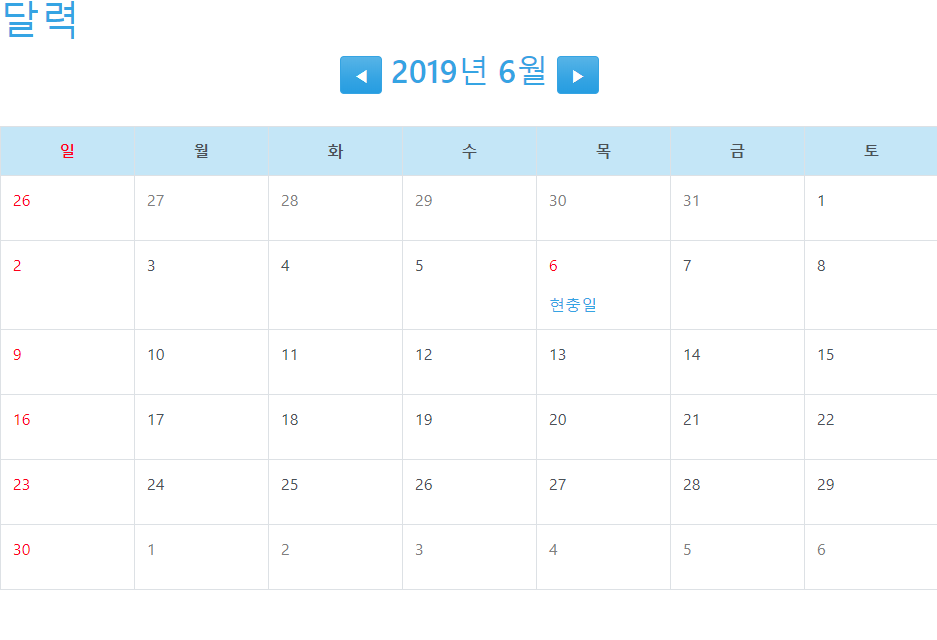
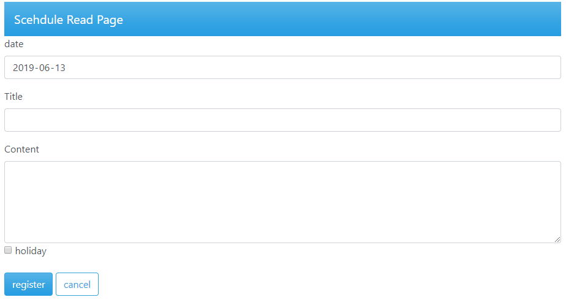
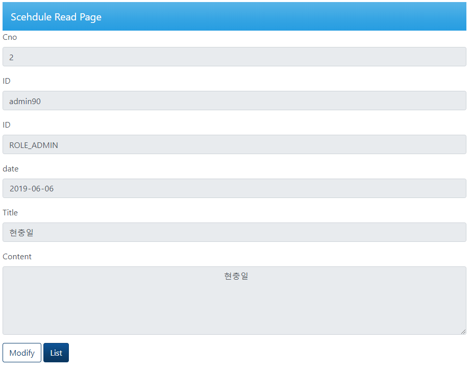
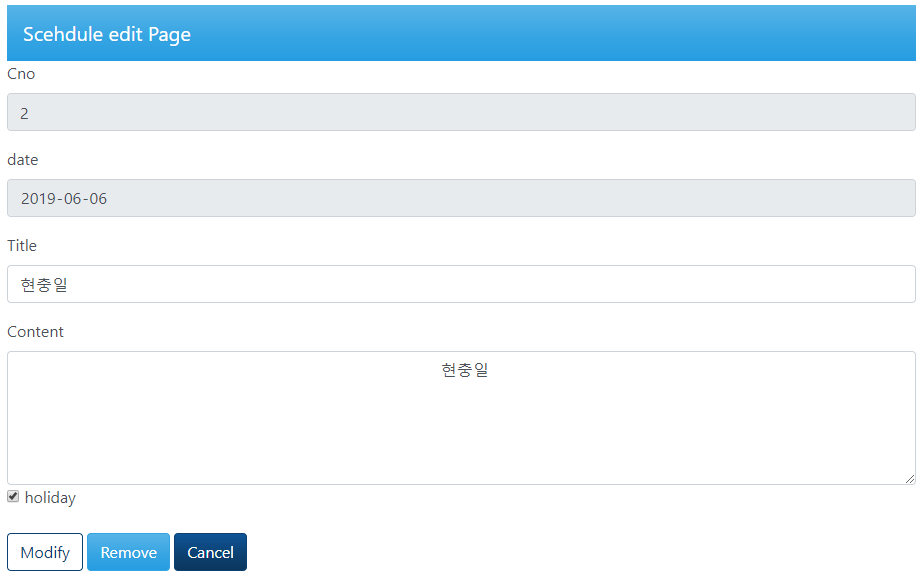

# 달력

1. [테이블](테이블)
1. [Mapper](#Mapper)
1. [domain](#domain)
### 테이블

-고유번호, 연, 월, 일 , 전체 날짜 , 휴일여부, 일정의 제목, 일정, 내용을 넣은 유저의 ID와 권한으로 이루어진 테이블
```sql
  
  CREATE TABLE `tb_calendar` (
	`cno` INT(11) NOT NULL AUTO_INCREMENT,
	`cal_year` SMALLINT(6) NOT NULL,
	`cal_month` SMALLINT(6) NOT NULL,
	`cal_day` SMALLINT(6) NOT NULL,
	`cal_date` VARCHAR(10) NOT NULL COLLATE 'utf8_bin',
	`cal_holi` TINYINT(4) NOT NULL DEFAULT '0',
	`cal_title` VARCHAR(50) NULL DEFAULT NULL COLLATE 'utf8_bin',
	`cal_content` VARCHAR(1000) NULL DEFAULT NULL COLLATE 'utf8_bin',
	`userid` VARCHAR(50) NOT NULL COLLATE 'utf8_bin',
	`userauth` VARCHAR(50) NOT NULL COLLATE 'utf8_bin',
	PRIMARY KEY (`cno`),
	INDEX `FK_tb_calendar_tbl_member` (`userid`),
	CONSTRAINT `FK_tb_calendar_tbl_member` FOREIGN KEY (`userid`) REFERENCES `tbl_member` (`userid`)
)
COLLATE='utf8_bin'
ENGINE=InnoDB
AUTO_INCREMENT=0
;

```

- VO도 동일한 구조로 작성

```java
import lombok.Data;

@Data
public class CalendarVO {
	private int cno;
	private int cal_year;
	private int cal_month;
	private int cal_day;
	private String cal_date;
	private int cal_holi;
	private String cal_title;
	private String cal_content;
	private String userid;
	private String userauth;
	
	public CalendarVO() {
	}
	
	
}
```

### Mapper

- 기본적으로는 게시판과 동일하나, 특정 날짜나 달, 유저에 따라 일정을 가져오고 삭제하는 기능을 추가.

|메소드|기능|
|---|---|
|get|특정한 일정을 가져오는 메소드|
|getByDay|일정목록을 특정날짜에 따라 가져오는 메소드|
|getByUserDay|특정 날의 일정을 유저에 따라 가져오는 메소드(로그인한 사용자에게 자기 일정만 보여주기 위한것|
|getByMonth|특정달의 일정을 가져오는 메소드|
|getByMonthUser|특정 유저의 한달일정을 가져오는 메소드|

```java
   	public CalendarVO get(int cno);
	public List<CalendarVO> getByDay(String date);
	public List<CalendarVO> getByUserDay(String date,String userid);
	public List<CalendarVO> getByMonth(@Param("startDate") String startDate,@Param("endDate") String endDate);
	public List<CalendarVO> getByMonthUser(@Param("startDate") String startDate,@Param("endDate") String endDate,@Param("userid") String userid);
	
	public void insert(@Param("newSc")CalendarVO newSc);
	
	public int delete(int cno);
	public int deleteDay(String date);
	public int deleteMulti(@Param("startDate") String startDate,@Param("endDate") String endDate);
	
	public int update(@Param("upSc")CalendarVO upSc);
```

```xml
  <?xml version="1.0" encoding="UTF-8"?>
<!DOCTYPE mapper PUBLIC "-//mybatis.org//DTD Mapper 3.0//EN" "http://mybatis.org/dtd/mybatis-3-mapper.dtd">
<mapper namespace="org.zerock.mapper.CalendarMapper">
	<select id="get" resultType="org.zerock.domain.CalendarVO">
	SELECT * FROM tb_calendar WHERE cno = #{cno}
	</select>
	<select id="getByDay" resultType="org.zerock.domain.CalendarVO">
	
		SELECT C.* FROM tb_calendar C WHERE C.cal_date=#{date}
	
	</select>
	<select id="getByMonth" resultType="org.zerock.domain.CalendarVO">
		
		<![CDATA[
			SELECT * FROM tb_calendar C WHERE C.cal_date>=#{startDate} AND C.cal_date<=#{endDate}
		]]>
	
	</select>
	
	<select id="getByMonthUser" resultType="org.zerock.domain.CalendarVO">
		
		<![CDATA[
			SELECT * FROM tb_calendar C WHERE C.cal_date>=#{startDate} AND C.cal_date<=#{endDate} AND(C.userauth = 'ROLE_ADMIN' OR C.userid = #{userid})
		]]>
	
	</select>
	
	<select id="getByUserDay" resultType="org.zerock.domain.CalendarVO">
	SELECT C.* FROM tb_calendar C WHERE (C.userauth = 'ROLE_ADMIN' OR C.userid = #{userid}) AND C WHERE C.cal_date=#{date}
	</select>
	
	
	<insert id="insert">
		INSERT INTO tb_calendar(cal_year,cal_month,cal_day,cal_date,cal_holi,cal_title,cal_content,userid,userauth) 
		VALUES(#{newSc.cal_year},#{newSc.cal_month},#{newSc.cal_day},#{newSc.cal_date},#{newSc.cal_holi},
		#{newSc.cal_title},#{newSc.cal_content},#{newSc.userid},#{newSc.userauth}); 
	
	</insert>
	<delete id="delete">
		DELETE FROM tb_calendar WHERE cno=#{cno}
	</delete>
	
	<delete id="deleteDay">
		DELETE FROM tb_calendar WHERE cal_date=#{date}
	</delete>
	
	<delete id="deleteMulti">
		<![CDATA[
		DELETE FROM tb_calendar WHERE cal_date>=#{startDate} AND cal_date<=#{endDate}
		]]>
	</delete>
	<update id="update">
		UPDATE tb_calendar SET cal_title=#{upSc.cal_title},cal_content=#{upSc.cal_content} WHERE cno = #{upSc.cno} 
	</update>
</mapper>
```
### domain

- CalendarVO 외엔 DB 없이 달력 정보를 뿌려주기위한 클래스로 CalendarDTO가 있음.
- joda의 localDateTime을 주로 사용하며 mapper에서 보낸 List를 Map으로 바꿔주는 메소드 역시 포함.

```java
import java.util.ArrayList;
import java.util.HashMap;
import java.util.List;
import java.util.Map;
import java.util.Set;

import org.joda.time.LocalDate;
import org.joda.time.format.DateTimeFormat;
import org.joda.time.format.DateTimeFormatter;
import org.zerock.domain.CalendarVO;

import lombok.extern.log4j.Log4j;
/*
 * 달력 관련 계산을 위한 메소드
 */
@Log4j
public class CalendarDTO{
	
	public static List<List<LocalDate>> getLocalArr(int year, int month,int startweek){//화면단에 뿌릴 날짜 계산 로직, 줄바꿈을 위해서 이중리스트
		List<List<LocalDate>> result = new ArrayList<>();
		List<LocalDate> tmp   = makeDateTimeList(year, month, startweek);
		int last = tmp.size()>=42?6:5;
		
		for (int i = 0; i < last; i++) { 
			result.add(tmp.subList(7*i, 7*(i+1))) ; 
		}
		
		return result;
		
	}
	
	

	public static List<LocalDate> makeDateTimeList(int year, int month,int startweek) {// 위의 메소드를 계산하기전 단순 날짜 리스트를 가져오는 메소드
	   ArrayList<LocalDate> listDay = new ArrayList<>();
		
	    LocalDate date = new LocalDate(year, month, 1);
		DateTimeFormatter fmt = DateTimeFormat.forPattern("yyyy-MM-dd");
		
		LocalDate lastDay = date.dayOfMonth().withMaximumValue();
		
		int weekOfDay = date.getDayOfWeek()-startweek+1;//이전달 표기를 위한 메소드
		if(weekOfDay<0) weekOfDay+=7;
		date = date.plusDays(-weekOfDay);

		listDay.add(date);
		
		while (fmt.print(date).compareTo(fmt.print(lastDay)) != 0) {
			date = date.plusDays(1);
			listDay.add(date);
		}
		log.debug(listDay.size());
		weekOfDay = date.getDayOfWeek();
		int lastweek = lastDay.getDayOfWeek();//달의 마지막날 요일 구하는 메소드
		
		
		int end = (6+lastweek-weekOfDay)%7;
		//if(end == 0) end = 7;
		for (int i = 0; i < end; i++) {
			date = date.plusDays(1);
			listDay.add(date);
		}
		log.info(listDay.size());
		return listDay;

	}
	
	public static Map<String,List<CalendarVO>> change(List<CalendarVO> calList){
		Map<String,List<CalendarVO>> rs = new HashMap<>();
		for (CalendarVO cal: calList) {
			Set<String> keySet = rs.keySet();
			String key = cal.getCal_date();
			List<CalendarVO> clist = new ArrayList<>();
			if(keySet.contains(key)) {
				clist = rs.get(key);
			}
			clist.add(cal);
			rs.put(key, clist);
		
		}
		return rs;
	}
	
	
	public static List<String> generateWeekList(int week) {//view의 요일 th
		// TODO Auto-generated method stub
		List<String> weekList = new ArrayList<String>();
		
		String[] weeksString = {"토","일","월","화","수","목","금"};
		week %= weeksString.length;
		
		for (int i = week; i < weeksString.length+week; i++) {
			weekList.add(weeksString[i%(weeksString.length)]);
		}
		
		return weekList;
	}

}

```
### service

- board처럼  service.interface와 serviceimpl.java로 나눠져있음
- mapper와 메소드명이 거의 동일

```java
import java.util.List;
import java.util.Map;

import org.joda.time.LocalDate;
import org.springframework.beans.factory.annotation.Autowired;
import org.springframework.stereotype.Service;
import org.zerock.calculate.CalendarDTO;
import org.zerock.domain.CalendarVO;
import org.zerock.mapper.CalendarMapper;

import lombok.Setter;
import lombok.extern.log4j.Log4j;

@Log4j
@Service
public class CalendarServiceImpl implements CalendarService{
	
	@Setter(onMethod_ = @Autowired)
	private CalendarMapper mapper;
	
	@Override
	public CalendarVO get(int cno) {
		return mapper.get(cno);
	}
	
	@Override
	public List<CalendarVO> listByDay(String date) {
		return mapper.getByDay(date);
	}
	
	@Override
	public Map<String,List<CalendarVO>> listByMonth(int year, int month,int startweek) {
		List<LocalDate> monthLlist=CalendarDTO.makeDateTimeList(year, month, startweek);
		return CalendarDTO.change(mapper.getByMonth(monthLlist.get(0).toString(), monthLlist.get(monthLlist.size()-1).toString()));
	}
	@Override
	public Map<String,List<CalendarVO>> listByMonth(int year, int month,int startweek,String userid) {
		List<LocalDate> monthLlist=CalendarDTO.makeDateTimeList(year, month, startweek);
		log.info(mapper.getByMonthUser(monthLlist.get(0).toString(), monthLlist.get(monthLlist.size()-1).toString(),userid));
		return CalendarDTO.change(mapper.getByMonthUser(monthLlist.get(0).toString(), monthLlist.get(monthLlist.size()-1).toString(),userid));
	}
	
	@Override
	public Map<String,List<CalendarVO>> listByMonth(String ym,int startweek) {
		return listByMonth(Integer.parseInt(ym.substring(0,4)), Integer.parseInt(ym.substring(4,6)),startweek);
	}
	
	
	@Override
	public void register(CalendarVO vo) {
		mapper.insert(vo);
	}
	
	@Override
	public boolean modify(CalendarVO vo) {
		// TODO Auto-generated method stub
		return mapper.update(vo)>0;
	}

	@Override
	public boolean remove(int cno) {
		// TODO Auto-generated method stub
		return mapper.delete(cno)>0;
	}

	
	@Override
	public List<List<LocalDate>> getLocalArr(int year, int month,int startweek){
		return CalendarDTO.getLocalArr(year, month, startweek);
	}
	@Override
	public List<String> generateWeekList(int week) {
		return CalendarDTO.generateWeekList(week);
	}
	
}
```

### view

- 날짜를 그대로 뿌림.
- 로그인 한 유저만 사용 가능하도록 처리
- 메인 화면

- 새로운 일정 추가

- 일정 보기

- 일정 수정/삭제

