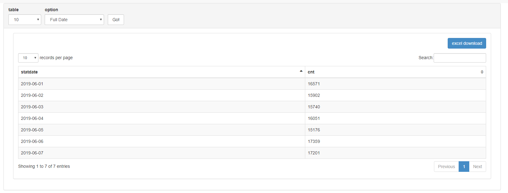
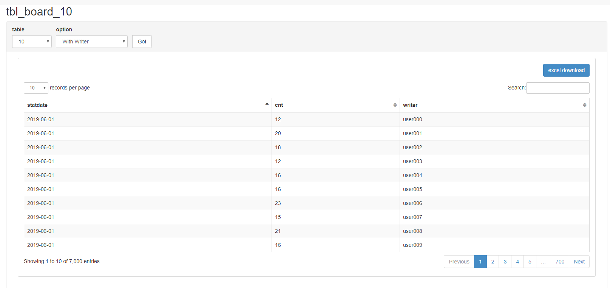
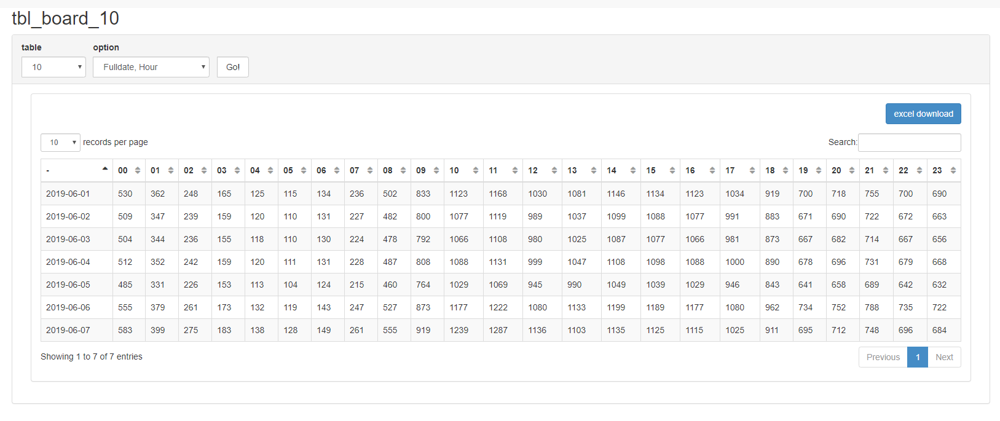
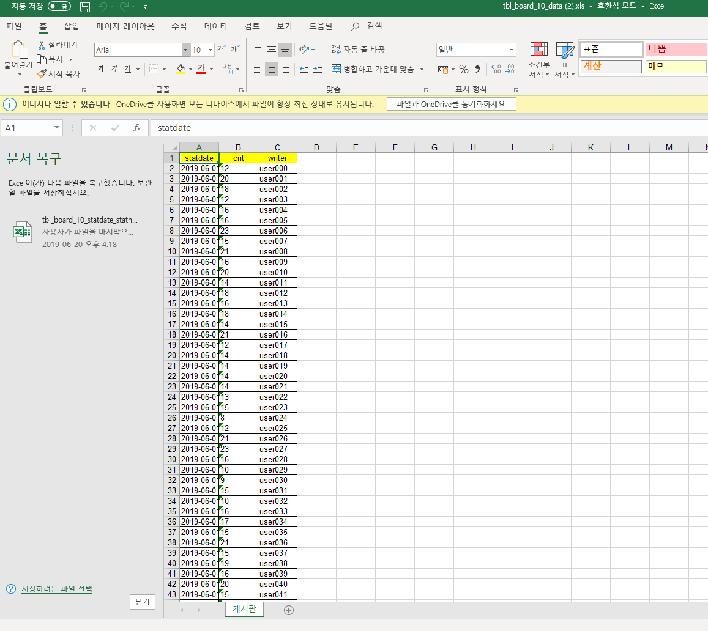

# 통계화면

1. [domain](#domain)
1. 

### domain

- 앞서 만든 3개의 테이블의 통계 조건을 저장하는 TableDTO 클래스 생성

```java
import java.util.HashMap;
import java.util.List;

import org.zerock.service.sta.StaService;

import lombok.Data;

@Data
public class TableDTO {
	
	private final String [] types = {"%Y-%m-%d","%H","%a","%U","%u","%d-%H","%w","%d"};
	public static final int YMD = 0,H = 1,A=2,U_l=3,U_s=4,D_H=5,W=6,D=7;
  //date_format타입을 쉽게 변경하기 위한 것들
	public HashMap<String, List <String>> colList;
	
	public TableDTO(String tableName,int type1,int type2) {
		super();
		this.tableName = tableName;
		try {
			SetFormatType(type1);
			SetFormatType2(type2);
			
		} catch (Exception e) {
		}
	}
	public TableDTO(String tableName,int type) {
		super();
		this.tableName = tableName;
		try {
			SetFormatType(type);
		} catch (Exception e) {
			this.formatType = types[YMD];			
		}
	}
	public TableDTO(String tableName) {
		super();
		this.tableName = tableName;
		setFormatColumn(types[YMD]);
	}
	
	public TableDTO() {
		super();
		this.tableName = StaService.BOARD_10;
		this.formatType = types[YMD];		
	}
  
	//기본은 10만개짜리 테이블, 날짜 풀로 가져옴
  //constructor에서 설정가능
  
	public void SetFormatType(int type) {
		this.formatType = types[type];
		this.formatColumn = "stat" + (type==H?"hour":"date");
	}
	
	public void SetFormatType2(int type) {
		this.formatType2   = types[type];
		this.formatColumn2 = "stat" + (type==H?"hour":"date");
	}
	//format를 쉽게 바꾸고 오타를 줄이기 위한 customSetter
	private String tableName;
	private String formatType;
	private String formatType2;// 날짜, 시간을 모두 가져와야할때 외엔 안쓰임
	
	
	private String formatColumn="statdate";
	private String formatColumn2="statdate";
	private boolean write=false;//글쓴이도 가져올지 묻는 변수

}

```

### mapper

- tableDTO를 파라미터로 받아 테이블 이름, 옵션 등에 따른 정보를 가져옴

```java

	public List<?> getStatistic(@Param("table") TableDTO table);
	public List<?> getStatisticMulti(@Param("table") TableDTO table);

```
```xml
<select id="getStatistic" resultType="map">
SELECT DATE_FORMAT(regdate, #{table.formatType}) AS ${table.formatColumn} ,COUNT(*) AS cnt 

<if test="table.write">
,writer
</if>
FROM ${table.tableName} GROUP BY DATE_FORMAT (regdate, #{table.formatType})
<if test="table.write">
,writer
</if>

</select>


<select id="getStatisticMulti" resultType="map">
SELECT DATE_FORMAT(regdate, #{table.formatType}) AS ${table.formatColumn}
,DATE_FORMAT(regdate, #{table.formatType2}) AS ${table.formatColumn2}
 ,COUNT(*) AS cnt FROM ${table.tableName} GROUP BY 
 DATE_FORMAT (regdate, #{table.formatType}),DATE_FORMAT(regdate, #{table.formatType2})

</select>

```

### Service&Controller

- 서비스에서 getSta..와 멀티를 하나로 묶어서 boolean을 파라미터로 받아서 true면 가로 세로 표로 전환하여 보낼 수 있게
multi false면 그냥 getStatistic으로 보내게 작성
- 컨트롤러에선 그대로 게시판처럼 뿌려줌.
-writer가 들어갈경우 데이터가 많아지므로 dataTable로 시각적으로만 페이징





### POI

- dependency에 poi 추가후 관련 디자인을 하는 메소드를 서비스에 추가하면 됨
- 자료를 내보내는 것 만이라면 ajax를 쓸 필요도 없이 get 이면 충분
- poimaker 메소드의 
```java
public void poiMaker(HttpServletResponse response,List<Map<String, Object>> datas,String title,boolean multi) throws Exception {
		// TODO Auto-generated method stub
		
		List<Map<String, Object>> list = datas;
		Set<String> keys = multi?new TreeSet<>(datas.get(0).keySet()):datas.get(0).keySet();
		
		 Workbook wb = new HSSFWorkbook();

		    Sheet sheet = wb.createSheet("게시판");

		    Row row = null;

		    Cell cell = null;

		    int rowNo = 0;


		    // 테이블 헤더용 스타일

		    CellStyle headStyle = wb.createCellStyle();

		    // 가는 경계선

		    headStyle.setBorderTop(BorderStyle.THIN);
		    headStyle.setBorderBottom(BorderStyle.THIN);
		    headStyle.setBorderLeft(BorderStyle.THIN);
		    headStyle.setBorderRight(BorderStyle.THIN);


		    // 배경색은 노란색

		    headStyle.setFillForegroundColor(HSSFColorPredefined.YELLOW.getIndex());
		    headStyle.setFillPattern(FillPatternType.SOLID_FOREGROUND);
		   
		    // 데이터는 가운데 정렬
		    headStyle.setAlignment(HorizontalAlignment.CENTER);

		    // 데이터용 경계 스타일 테두리만 지정

		    CellStyle bodyStyle = wb.createCellStyle();

		    bodyStyle.setBorderTop(BorderStyle.THIN);
		    bodyStyle.setBorderBottom(BorderStyle.THIN);
		    bodyStyle.setBorderLeft(BorderStyle.THIN);
		    bodyStyle.setBorderRight(BorderStyle.THIN);

		    // 헤더 생성
		    row = sheet.createRow(rowNo++);
		    
		    int titleCnt = 0;
		    for (String key : keys) {
				
		    	cell = row.createCell(titleCnt++);
		    	cell.setCellStyle(headStyle);
		    	cell.setCellValue(key);
			}
		    
		    titleCnt = 0;

		    // 데이터 부분 생성

		    for(Map<String, Object> mapData : list) {

		        row = sheet.createRow(rowNo++);
		        
		        for (String key  : keys) {
			    	cell = row.createCell(titleCnt++);
			    	cell.setCellStyle(key.equals("-")?headStyle:bodyStyle);
			    	cell.setCellValue(mapData.get(key).toString());
				}
		        titleCnt = 0;
		        
		    }


		    // 컨텐츠 타입과 파일명 지정

		    response.setContentType("ms-vnd/excel");
		    response.setHeader("Content-Disposition", "attachment;filename="+title+".xls");

		    // 엑셀 출력

		   wb.write(response.getOutputStream());
		   wb.close();

	}
	

```

