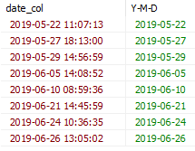

# 15

[이전](./14.md)|[index 페이지로](./00index.md)
---|---
<hr>

### 목차
1. MySQL에서의 날짜
1.
1.

## MySQL에서의 날짜

1. DATE, DATETIME, TIMESTAMP 비교

| 데이터 타입 |      값     |      기본 포맷      |        제공 범위        |
|:-----------:|:-----------:|:-------------------:|:-----------------------:|
|     DATE    |     날짜    |      YYYY-MM-DD     | 1000-01-01 ~ 9999-12-31 |
|   DATETIME  | 날짜 + 시간 | YYYY-MM-DD HH:MM:SS | 1000-01-01 ~ 9999-12-31 |
|  TIMESTAMP  | 날짜 + 시간 | YYYY-MM-DD HH:MM:SS | 1000-01-01 ~ 9999-12-31 |

- DATETIME과 TIMESTAMP의 차이점
	+ DATETIME은 입력되는 날짜와 시간을 그대로 입력받음.
	+ TIMESTAMP는 time_zone이라는 시스템 변수로 저장된 값을 기본으로 하여 날짜와 시간정보를 입력받음.
	

2. MySQL 시간 설정
	```sql
	 DATE_ADD(기준 날짜, INTERVAL 숫자 인자) -- 시간 더하기
	 DATE_SUB(기준 날짜, INTERVAL 숫자 인자) -- 시간 빼기
	```
* 사용가능한 인자

	|  인자  | 기능 |
	|:------:|:----:|
	| second |  초  |
	| minute |  분  |
	|  hour  | 시간 |
	|   day  |  일  |
	|  month |  달  |
	|  year  |  년  |

3. date_format을 이용하여 원하는 데이터 뽑기

- DATE_FORMAT : MySQL에서 DATE, DATETIME, TIMESTAMP 값을 원하는 형태로 가져오기 위한 함수
	```sql
	SELECT DATE_FORMAT({date_col}, '%?') FROM {tableName};
	```
- 사용 하는 지정자들

지정자|	영어설명	|	한글설명	
--|--|--
%a	|Abbreviated weekday name (Sun..Sat)|	짧은 요일 이름(영문) 
%b	|Abbreviated month name (Jan..Dec)|	달 이름(영문, 짧게)
%c	|Month, numeric (0..12)|	달의 번호
%D	|Day of the month with English suffix (0th, 1st, 2nd, 3rd, ...)|	몇일인지(영어로 n번째)
%d	|Day of the month, numeric (00..31)|	몇일인지(숫자만)
%e	|Day of the month, numeric (0..31)|	%d와 동일
%f	|Microseconds (000000..999999)|	마이크로 초
%H	|Hour (00..23)| 몇시인지(24시간 기준)
%h	|Hour (01..12)|	몇시인지(12시간 기준)
%I	|Hour (01..12)|	%h와 동일
%i	|Minutes, numeric (00..59)|	몇분인지
%j	|Day of year (001..366)|	올해의 몇번째 날인지
%k	|Hour (0..23)|	24시간 기준 몇시인지
%l	|Hour (1..12)|	12시간 시준 몇시인지
%M	|Month name (January..December)|	몇월인지(영문이름, %b보다 김)
%m	|Month, numeric (00..12)|	몇월인지(숫자)
%p	|AM or PM|	오전/오후표기
%r	|Time, 12-hour (hh:mm:ss followed by AM or PM)|	오전/오후 기준 시간(12시간기준)
%S	|Seconds (00..59)|	몇초인지
%s	|Seconds (00..59)|	몇초인지
%T	|Time, 24-hour (hh:mm:ss)|	24시간 기준 시:분:초
%U	|Week (00..53), where Sunday is the first day of the week|	일요일이 주의 시작이라고 할때 올해의 몇번째주 인지(새해와 마지막주가 겹치면 올해의 마지막주가 아닌 다음해의 마지막주로 간주)
%u	|Week (00..53), where Monday is the first day of the week|	월요일이 주의 시작이라고 할때 올해의 몇번째주 인지
%V	|Week (01..53), where Sunday is the first day of the week; used with %X|	%U와 동일(0번째가 없음)
%v	|Week (01..53), where Monday is the first day of the week; used with %x|	%u와 동일(0번째가 없음)
%W	|Weekday name (Sunday..Saturday)|	무슨 요일인지 (영문)
%w	|Day of the week (0=Sunday..6=Saturday)|	무슨 요일인지 (숫자)
%X	|Year for the week where Sunday is the first day of the week, numeric, four digits; used with %V|	%V와 동일
%x	|Year for the week, where Monday is the first day of the week, numeric, four digits; used with %v|	%v와 동일
%Y	|Year, numeric, four digits|	몇년도인지
%y	|Year, numeric, two digits|	맨뒤 2자리만 표기
%%	|A literal '%'.|	%표시

- 여러개 한번에도 사용가능

ex)
```sql
SELECT A.{date_col}, DATE_FORMAT(A.{date_col}, '%Y-%m-%d') AS 'Y-M-D' FROM {tableName} A GROUP BY DATE_FORMAT(A.{date_col}, '%Y-%m-%d')
```
   + 결과		
	
   


[이전](./14.md)|[index 페이지로](./00index.md)
---|---
